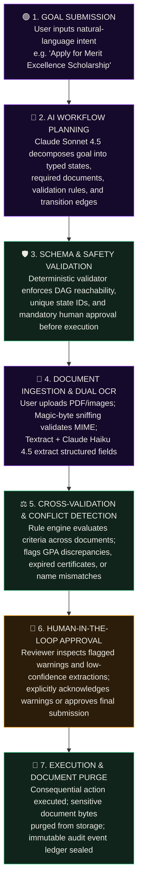
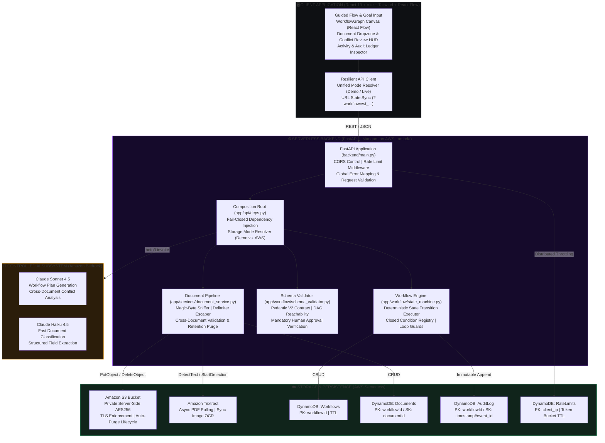

# FlowForge

**From intent to execution. The LLM plans, the state machine executes, the human stays in control.**

FlowForge is a domain-agnostic agentic workflow engine built on AWS serverless infrastructure and FastAPI. It transforms ambiguous, natural-language operational goals into strictly validated JSON state machines, orchestrating intelligent document extraction, cross-document discrepancy validation, and human-in-the-loop approval gates before triggering consequential actions.

Runtime Modes: **Local Offline Demo** (`DEMO_MODE=true`) & **Serverless AWS Cloud** (`DEMO_MODE=false`)  
Primary Foundation Models: **Anthropic Claude Sonnet 4.5** (Workflow Generation & Cross-Validation) & **Claude Haiku 4.5** (Extraction & Classification)  
Core Principle: **The LLM plans. The state machine executes. The human stays in control.**

---

## What is FlowForge?

FlowForge bridges the dangerous gap between unpredictable conversational AI and mission-critical business automation.

Traditional approaches force developers into two flawed extremes:
1. **Unconstrained Autonomous Agents (ReAct / Prompt Chaining)**: Non-deterministic LLM loops that hallucinate invalid transitions, skip mandatory validation steps, leak context across boundaries, and trigger real-world actions without provable guarantees.
2. **Hardcoded Workflow Engines (Legacy BPMN / Rigid Form Builders)**: Brittle systems requiring manual schema authoring, static UI forms, and extensive engineering overhead for every slight variation in business policy.

**FlowForge unifies the best of both:**
- The **LLM acts strictly as a planner**: It translates natural-language goals into structured workflow JSON complying with an exacting schema.
- The **deterministic state machine acts as the executor**: It enforces transition rules, validates prerequisites, gates sensitive states, and prevents arbitrary execution.
- The **human retains ultimate authority**: Critical approvals, policy warnings, and low-confidence document extractions require explicit human acknowledgment.

---

## Why FlowForge?

| Feature | Unconstrained AI Agents | Legacy Workflow Engines | FlowForge Protocol |
| :--- | :--- | :--- | :--- |
| **Workflow Generation** | Unpredictable text completions; prone to drift. | 100% manual code or visual flowchart authoring. | **Natural-Language Goal Planning**; generated once into strict JSON Schema. |
| **Execution Safety** | Black-box autonomous decisions; tools called blindly. | Hardcoded procedural logic; inflexible to new goals. | **Deterministic State Machine**; closed transition condition registry; zero arbitrary code. |
| **Document Ingestion** | Raw OCR dumped into prompt; injection vulnerability. | Template-based OCR; breaks on format variations. | **Dual-Engine OCR (Textract + Haiku 4.5)**; XML sandboxing & magic-byte validation. |
| **Discrepancy Checking** | Unreliable semantic LLM comparison; silent omissions. | Rigid manual rule coding per document type. | **Cross-Document Discrepancy Engine**; heuristic rule evaluation with confidence scoring. |
| **Human Oversight** | Ad-hoc or completely absent; post-facto review. | Out-of-band email notifications or external queues. | **Structurally Enforced Approval Gates**; execution states blocked until signed off. |
| **Audit Trail** | Ephemeral chat history; hard to reconstruct state. | Fragmented application logs across services. | **Immutable Audit Ledger**; microsecond composite keys (`timestamp#event_id`) with full replayability. |

---

## Product & Capabilities

- **Dynamic Goal Decomposition**: Converts natural-language intent (e.g., *"Apply for the Merit Excellence Scholarship"*) into a directed acyclic graph (DAG) of validated states, transition conditions, and requirements.
- **Deterministic State Machine**: Auto-chains automated transitions (`automatic`, `validation`, `execution`) while safely halting at interactive boundaries (`user_input`, `document_required`, `human_approval`).
- **Dual-Engine Document Intelligence**: Amazon Textract handles high-fidelity OCR (synchronous for images, asynchronous polling with S3 for PDFs), followed by Claude Haiku 4.5 structured field extraction.
- **Cross-Document Discrepancy Detection**: Evaluates extracted data across multiple documents simultaneously (e.g., verifying that a transcript GPA matches academic policy requirements and income certificates match declared figures).
- **Human-in-the-Loop Review Gates**: Surfaces flagged discrepancies, policy warnings, and sub-threshold extractions in a unified review interface requiring explicit operator sign-off.
- **Ephemeral Document Retention**: Automatically purges raw document bytes from storage upon reaching any terminal workflow state (`completed`, `cancelled`, `failed`), retaining only cryptographic audit entries.
- **Zero-AWS Local Portability**: Operates 100% locally out-of-the-box using in-memory repositories and deterministic mock adapters, seamlessly switching to live AWS services via configuration.

---

## How It Works



---

## System Architecture



---

## Subsystems & Core Modules

| Module / Component | Path | Responsibility | Verification Status |
| :--- | :--- | :--- | :--- |
| **HTTP Surface & Routes** | `backend/app/api/routes.py` | Thin REST API, request models, error mapping, and document upload streaming. | **VERIFIED (143 Tests)** |
| **State Machine Executor** | `backend/app/workflow/state_machine.py` | Pure deterministic state advancement, loop detection, and transition gating. | **VERIFIED (Deterministic)** |
| **Schema Validator** | `backend/app/workflow/schema_validator.py` | Enforces DAG reachability, condition syntax, and pre-execution human approval. | **VERIFIED (Strict Pydantic)** |
| **Bedrock Provider** | `backend/app/ai/bedrock_provider.py` | AWS Bedrock Anthropic Claude Sonnet/Haiku 4.5 adapter with bounded retries. | **VERIFIED (Static & Mock)** |
| **Document Intelligence** | `backend/app/documents/aws_processor.py` | Dual synchronous/asynchronous Textract processor with S3 URI parsing. | **VERIFIED (Unit Tested)** |
| **Distributed Rate Limiter** | `backend/app/core/rate_limit.py` | DynamoDB token bucket limiter with fail-open fallback and API Gateway quotas. | **VERIFIED (Integration Tested)** |
| **SAM Infrastructure** | `infrastructure/template.yaml` | AWS SAM template: API Gateway HTTP API, Lambda, S3, DynamoDB, CloudWatch. | **VALIDATED (cfn-lint Clean)** |
| **Interactive Frontend** | `frontend/src/` | React 19 + TypeScript + Tailwind UI with React Flow visual DAG and HUD. | **BUILT (0 Lint Errors)** |

---

## Dual-Mode Operational Architecture

FlowForge is architected with a strict dependency-inversion model. All external services (LLM, Document OCR, Object Store, Database) sit behind clean Python interfaces:

| Abstract Interface | Demo Mode (`DEMO_MODE=true`) | AWS Production Mode (`DEMO_MODE=false`) |
| :--- | :--- | :--- |
| `LLMProvider` | `MockLLMProvider` (deterministic, zero cost) | `BedrockProvider` (Claude Sonnet 4.5 & Haiku 4.5) |
| `DocumentProcessor` | `MockDocumentProcessor` (token-based heuristic) | `AWSDocumentProcessor` (Amazon Textract Async/Sync) |
| `DocumentObjectStore`| `MockObjectStore` (in-memory with 50MB budget) | `S3DocumentStore` (Amazon S3 private encrypted) |
| `WorkflowRepository` | `InMemoryRepository` (thread-safe, isolated) | `DynamoRepository` (Amazon DynamoDB with TTL) |
| `RateLimiter` | `MemoryRateLimiter` (token bucket) | `DynamoRateLimiter` (distributed counter table) |

*Fail-Closed Stance*: Outside of `DEMO_MODE`, the application fails closed at startup with `ServiceConfigurationError` if any AWS service cannot be initialized, preventing silent degradation to mocks.

---

## Evaluation & Verification Baseline

FlowForge includes an end-to-end evaluation harness (`evaluation/run_evaluation.py`) that tests system integrity against ground-truth document corpora:

| Evaluation Metric | Target | Measured Result | Samples | Status |
| :--- | :---: | :---: | :---: | :---: |
| **Workflow Generation Validity** | &ge; 95.0% | **100.0%** | 12 | **PASS** |
| **Document Classification Accuracy** | &ge; 90.0% | **100.0%** | 9 | **PASS** |
| **Field Extraction Accuracy** | &ge; 85.0% | **100.0%** | 26 | **PASS** |
| **Conflict Detection Accuracy** | &ge; 80.0% | **100.0%** | 3 | **PASS** |
| **Workflow Generation Latency** | &lt; 5000 ms | **0.14 ms** | 12 | **PASS** |
| **Document Processing Latency** | &lt; 10000 ms | **0.07 ms** | 9 | **PASS** |

> [!NOTE]
> The baseline numbers above reflect the **deterministic mock pipeline under `DEMO_MODE=true`**, verifying contract interfaces, schema parsing, and state transition heuristics. Live evaluations against foundation models require passing `--provider bedrock` with configured AWS credentials.

---

## Architectural Limitations & Security Boundaries

FlowForge is currently designed and implemented as an **anonymous, single-tenant proof-of-concept / demo workflow engine**.

- **Access Control & Identity**: Workflows and documents are keyed by high-entropy UUIDs (`wf_<12 hex>`). Security relies on identifier entropy ($16^{12} \approx 2.81 \times 10^{14}$ possibilities) and IP-based rate limiting (60 rpm/IP). The API does **not** include user authentication (Cognito/JWT/OIDC) or user-level ownership isolation (`owner_id`).
- **Production Multi-Tenancy Requirements**: Operating FlowForge as a multi-tenant production service strictly requires adding:
  1. An API Gateway Cognito / OIDC authorizer validating user tokens;
  2. Identity propagation storing `owner_id` on workflows and documents;
  3. Ownership authorization checks enforcing `workflow.owner_id == authenticated_user`;
  4. Tenant-segregated DynamoDB partition keys and S3 object prefixes;
  5. Role-based access control (RBAC) separating applicants from reviewers.
- **Offline Evaluation Boundary**: Ground-truth test metrics verify deterministic pipeline mechanics and schema compliance. Live AWS cloud deployments must be verified against active AWS accounts and Bedrock model subscriptions.

---

## Getting Started

### Prerequisites
- **Python 3.12** (or 3.10+)
- **Node.js &ge; 20.0.0** and **npm**
- **AWS SAM CLI** (optional, for cloud packaging and deployment)

### 1. Backend Setup (Local Demo Mode)
```bash
cd backend
python -m venv .venv
source .venv/bin/activate       # On Windows: .venv\Scripts\activate
pip install -r requirements.txt
cp ../.env.example .env         # Defaults to DEMO_MODE=true
uvicorn main:app --reload
```
The API is live at `http://localhost:8000` with interactive OpenAPI docs at `http://localhost:8000/docs`.

### 2. Frontend Setup
```bash
cd frontend
npm install
npm run dev
```
Open `http://localhost:5173` to launch the guided FlowForge interface.

---

## Verification & Testing Suite

Run the full local test and validation suite from the project root:

```bash
# 1. Run backend unit & integration tests (143 tests)
python -m pytest backend/tests/ -q

# 2. Run Ruff linter across backend and evaluation code
python -m ruff check backend/app backend/tests backend/main.py backend/scripts
python -m ruff check --config backend/pyproject.toml evaluation

# 3. Validate CloudFormation & SAM Infrastructure
cfn-lint infrastructure/template.yaml
sam validate --lint --template infrastructure/template.yaml

# 4. Run deterministic evaluation pipeline
python evaluation/run_evaluation.py --strict

# 5. Lint and build frontend production bundle
cd frontend && npm run lint && npm run build && cd ..

# 6. Run end-to-end smoke demo script
python backend/scripts/smoke_demo.py
```

---

## Documentation Hub

For in-depth specifications, architectural decisions, and operational guides:

- [**System Architecture**](docs/architecture.md) — Runtime topology, component map, data models, and persistence boundaries.
- [**Workflow Engine Contract**](docs/workflow-engine.md) — State machine semantics, registered transition predicates, and validation rules.
- [**AI Architecture**](docs/ai-architecture.md) — Bedrock prompt engineering, XML delimiter sandboxing, and confidence thresholds.
- [**Deployment Runbook**](docs/deployment-runbook.md) — Step-by-step AWS SAM cloud deployment, Bedrock model activation, and operations.
- [**Evaluation Methodology**](docs/evaluation.md) — Ground-truth dataset, metric definitions, and reproduction commands.
- [**API Reference**](docs/api-reference.md) — Comprehensive OpenAPI endpoint catalog and request/response schemas.

---

*FlowForge is open-source agentic workflow infrastructure.*