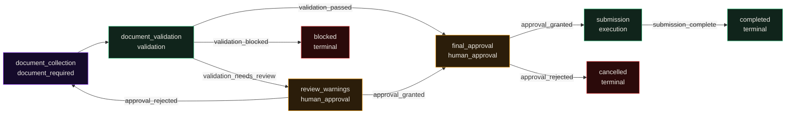
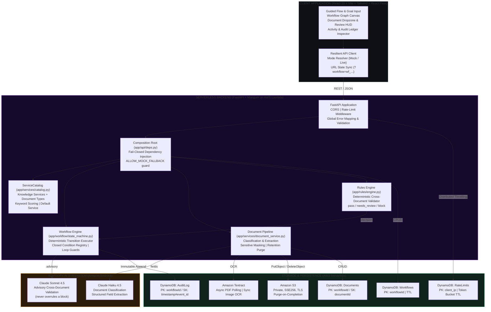

# FlowForge

> **From eligibility intent to audited submission — knowledge-verified workflows, deterministic rules, and a human who stays in control.**

FlowForge is a **knowledge-driven agentic workflow engine** for government-style application processing (scholarships, pensions, income certificates). It takes a plain-language goal, matches it to a **curated knowledge service**, runs submitted documents through a **deterministic rules engine**, lets an **advisory AI layer** flag concerns, and gates every consequential submission behind explicit human approval — with a tamper-evident audit trail throughout.

<p align="center">
  
  
  
  
  
  
</p>

---

## Table of Contents

- [What is FlowForge?](#what-is-flowforge)
- [Why FlowForge?](#why-flowforge)
- [Product & Capabilities](#product--capabilities)
- [How It Works](#how-it-works)
- [System Architecture](#system-architecture)
- [Core Subsystems](#core-subsystems)
- [Dual-Mode Operational Architecture](#dual-mode-operational-architecture)
- [Demo Services](#demo-services)
- [Safety Contract](#safety-contract)
- [Evaluation & Verification Baseline](#evaluation--verification-baseline)
- [Security Boundaries](#security-boundaries)
- [Getting Started](#getting-started)
- [Verification & Testing Suite](#verification--testing-suite)
- [Documentation Hub](#documentation-hub)

---

## What is FlowForge?

FlowForge bridges the gap between unpredictable conversational AI and mission-critical business automation. Traditional approaches force developers into one of two broken extremes:

1. **Unconstrained autonomous agents** — non-deterministic LLM loops that hallucinate invalid transitions, skip mandatory validation steps, and trigger consequential actions without provable guarantees.
2. **Hardcoded workflow engines** — brittle systems that demand manual schema authoring and months of engineering for every variation in business policy.

**FlowForge unifies the best of both:**

- **The rules engine owns the hard decision.** A deterministic cross-document validator evaluates extracted fields against scheme requirements (`max_amount`, `min_age`, `not_expired`, `eq`, `within_days`, name consistency) and issues a provable `pass` / `needs_review` / `block`.
- **The AI is strictly advisory.** Foundation models enrich classification, extraction, and review — they can flag concerns that prompt a human review, but they **can never reverse a deterministic block** or invent evidence.
- **Workflows come from curated knowledge, not model output.** `create_workflow` builds the state machine from an approved knowledge service template (`planner: knowledge-template`), so every run starts from a verified, schema-checked plan.
- **The human retains ultimate authority.** Every submission passes through an explicit approval gate. Nothing is sent without consent.

---

## Why FlowForge?

| Dimension | Unconstrained AI Agents | Legacy Workflow Engines | **FlowForge Protocol** |
| :--- | :--- | :--- | :--- |
| **Workflow construction** | Unpredictable text completions; prone to drift. | 100% manual code or visual flowchart authoring. | **Knowledge templates**; curated services matched by keyword scoring with a documented default. |
| **Eligibility decisions** | Black-box judgment calls, no reproducibility. | Procedural code, rewritten per scheme. | **Deterministic rules engine** (`app/rules/engine.py`); closed rule registry with documented semantics. |
| **AI involvement** | Autonomous tool-calling, no gates. | None. | **Advisory-only layer**; can prompt review, can never overrule a block. |
| **Document ingestion** | Raw OCR piped straight into prompts. | Template OCR; breaks on format variation. | **Classification + structured extraction**; XML sandboxing, magic-byte & MIME validation, sensitive-field masking. |
| **Human oversight** | Ad-hoc or absent. | Out-of-band emails or external queues. | **Structurally enforced approval gates**; execution states blocked until sign-off. |
| **Audit trail** | Ephemeral chat history. | Fragmented application logs. | **Immutable audit ledger**; `workflow_created`, `field_extracted`, `validation_result`, `human_approval`, `execution`, `documents_purged` events. |
| **Retention** | Files live forever in prompts/blobs. | Manual cleanup. | **Purged on completion only**; blocked/cancelled bundles are retained for human review. |

---

## Product & Capabilities

- **Knowledge-first service catalog** — `backend/knowledge/` ships three verified services (post-matric scholarship, old-age pension, income certificate) and a 7-class document-type catalog. Goals map to services via pure keyword scoring; a vague goal always lands on the flagship scholarship demo.
- **Deterministic validation engine** — required-document completeness, required-field extraction checks, scheme rules (`max_amount`, `min_amount`, `eq`, `not_expired`, `min_age`, `within_days`), and cross-document **name-consistency** checks with tolerant fuzzy matching. Errors ⇒ `block`, warnings ⇒ `needs_review`.
- **Advisory AI with hard safety invariants** — the LLM may downgrade `pass → needs_review` (on flagged warnings or when advisory confidence falls below `CONFIDENCE_PASS`), but it can never upgrade, unblock, or weaken a deterministic `block`. Advisory issues are deduplicated and evidence must come from the documents.
- **Structured document intelligence** — classification and field extraction (Amazon Textract OCR + Claude Haiku 4.5 in the cloud; deterministic token-based mocks locally), magic-byte sniffing, allowed-MIME enforcement, and masking of sensitive fields (Aadhaar number, account numbers, certificate numbers) before persistence.
- **Human-in-the-loop gates** — `user_input`, `document_required`, and `human_approval` states halt the state machine; warnings and sub-threshold extractions surface in a unified review UI.
- **State persistence & cold-start safety** — `validation_result`, `validation_status`, `profile`, and the submission receipt (`confirmation_id`, `eligible`) are persisted in `workflow.collected_data`, so a cold restart never loses eligibility or confirmation state.
- **Retention with review in mind** — document bytes are purged **only when a workflow completes**. Blocked and cancelled applications keep their documents so a human can inspect what went wrong; every purge is recorded as a `documents_purged` audit event.
- **Zero-AWS local portability** — in `DEMO_MODE`, the entire stack runs on in-memory repositories and deterministic mock adapters. Flip a flag for live AWS (Bedrock, Textract, S3, DynamoDB).
- **Interactive frontend** — a React 19 + Vite guided flow with a workflow graph canvas, document dropzones, a validation/review HUD, and a full activity ledger — buildable against an offline mock that mirrors the backend corpus bit-for-bit.

---

## How It Works

```mermaid
%%{init: {"flowchart": {"htmlLabels": false}} }%%
flowchart TD
    A["1. GOAL SUBMISSION\nNatural-language intent,\ne.g. 'Apply for a post-matric scholarship'"] --> B["2. SERVICE MATCHING\nServiceCatalog scores the goal\nagainst knowledge keywords (pure, no LLM)\nDefault: post-matric scholarship"]
    B --> C["3. TEMPLATE WORKFLOW\nApproved knowledge service selected;\nstate machine instantiated from template\nplanner=knowledge-template"]
    C --> D["4. DOCUMENT INGESTION\nUpload Aadhaar, income certificate, marks memo,\nbonafide certificate, bank passbook\nMagic-byte + MIME validation, sensitive masking"]
    D --> E["5. DETERMINISTIC VALIDATION\nRules engine: income ceiling, validity,\nage, BPL category, name consistency\n=> pass / needs_review / block"]
    E --> F["6. ADVISORY AI\nCross-validation adds warnings only;\nCANNOT reverse a deterministic block\nConfidence < threshold => needs_review"]
    F --> G["7. HUMAN REVIEW GATE\nReviewer acknowledges warnings or\nfixes documents; final approval required\nbefore anything is submitted"]
    G --> H["8. EXECUTION & RETENTION\nSubmission receipt issued (confirmation_id,\neligible); documents purged ONLY on completion;\naudit ledger sealed"]

    style A fill:#150a2b,stroke:#9945ff,color:#ece9e3
    style B fill:#150a2b,stroke:#9945ff,color:#ece9e3
    style C fill:#10241b,stroke:#3fcf8a,color:#ece9e3
    style D fill:#150a2b,stroke:#9945ff,color:#ece9e3
    style E fill:#10241b,stroke:#3fcf8a,color:#ece9e3
    style F fill:#2b1d0a,stroke:#f59e0b,color:#ece9e3
    style G fill:#2b1d0a,stroke:#f59e0b,color:#ece9e3
    style H fill:#10241b,stroke:#3fcf8a,color:#ece9e3
```



The shared workflow shape (identical across services):



---

## System Architecture



---

## Core Subsystems

| Module | Path | Responsibility | Verification |
| :--- | :--- | :--- | :--- |
| **Service Catalog** | `backend/app/services/catalog.py` | Loads `knowledge/services/*.json` + `knowledge/document_types.json`; goal→service keyword matching with default fallback. | **Tested** |
| **Rules Engine** | `backend/app/rules/engine.py` | Deterministic `validate_application`: required docs, required fields, scheme rules, name-consistency; owns the hard decision. | **Tested (deterministic)** |
| **Workflow Engine** | `backend/app/workflow/state_machine.py` | Pure deterministic advancement; closed condition registry; terminal-state handling. | **Tested (deterministic)** |
| **Schema Validator** | `backend/app/workflow/schema_validator.py` | Enforces condition syntax, reachability, and structural integrity of generated plans. | **Tested (strict Pydantic)** |
| **Workflow Service** | `backend/app/services/workflow_service.py` | Template instantiation (`planner=knowledge-template`), advisory merge, state persistence, retention purge. | **Tested (integration)** |
| **Document Pipeline** | `backend/app/services/document_service.py` | Upload, classification, extraction, masking, retention purge on completion. | **Tested** |
| **AI Adapters** | `backend/app/ai/` | `MockLLMProvider` (deterministic) / `BedrockProvider` (Sonnet 4.5 advisory, Haiku 4.5 extraction). | **Tested (static & mock)** |
| **Knowledge Services** | `backend/knowledge/` | Three curated service templates + 7-class document-type catalog with classification signals & sensitive fields. | **Validated** |
| **Rate Limiter** | `backend/app/core/rate_limit.py` | DynamoDB token bucket with fail-open fallback. | **Tested (integration)** |
| **HTTP Surface** | `backend/app/api/routes.py` | REST API: create/get/advance workflows, upload documents, audit listing. | **Tested (API)** |
| **Frontend** | `frontend/src/` | React 19 + TypeScript guided flow, graph canvas, review HUD, audit inspector. | **Built (0 lint errors)** |
| **Infrastructure** | `infrastructure/template.yaml` | AWS SAM: API Gateway HTTP API, Lambda, S3, DynamoDB, CloudWatch. | **Validated (SAM)** |

---

## Dual-Mode Operational Architecture

All external services sit behind clean Python interfaces. The composition root fails **closed**: outside `DEMO_MODE`, a service that cannot initialize raises `ServiceConfigurationError` at startup rather than silently substituting a mock (unless `ALLOW_MOCK_FALLBACK=true`).

| Abstract Interface | Demo Mode (`DEMO_MODE=true`) | AWS Production Mode (`DEMO_MODE=false`) |
| :--- | :--- | :--- |
| `LLMProvider` | `MockLLMProvider` (deterministic, zero cost) | `BedrockProvider` (Claude Sonnet 4.5 advisory / Haiku 4.5 extraction) |
| `DocumentProcessor` | `MockDocumentProcessor` (18-file eval corpus) | `AWSDocumentProcessor` (Amazon Textract async/sync) |
| `DocumentObjectStore` | `MockObjectStore` (in-memory) | `S3DocumentStore` (private, encrypted) |
| `WorkflowRepository` | `InMemoryRepository` (thread-safe) | `DynamoRepository` (Amazon DynamoDB + TTL) |
| `RateLimiter` | `MemoryRateLimiter` (token bucket) | `DynamoRateLimiter` (distributed token bucket) |

**Mode contract.** `backend/.env` is the single source of truth. `DEMO_MODE=true` runs the whole stack with mocks and an in-memory store — no AWS account, no credentials, fully deterministic. `DEMO_MODE=false` requires initialized AWS services and fails closed if any are missing.

---

## Demo Services

The knowledge catalog ships with three curated services, each with its own required documents, deterministic rules, and workflow template. All reference data is under `backend/knowledge/`.

| Service | Goal keywords | Required documents | Deterministic rules |
| :--- | :--- | :--- | :--- |
| **Post-matric scholarship** (default) | `scholarship`, `post matric`, `merit`, `college`, `fee`, `nsp` | Aadhaar, income certificate, marks memo, bonafide certificate, bank passbook | Income ceiling `≤ ₹2,50,000` (`max_amount`); income certificate must not be expired (`not_expired`); cross-document name consistency |
| **Old-age pension (IGNOAPS)** | `pension`, `old age`, `ignoaps`, `nsap`, `bpl`, `senior citizen` | Aadhaar, ration card, bank passbook | Age `≥ 60` from Aadhaar DOB (`min_age`); ration card category must be `BPL` (`eq`); name consistency |
| **Income certificate** | `income certificate`, `aay praman patra`, `tehsildar`, `income proof` | Aadhaar, income self-declaration | Self-declaration must be recent (`within_days` ≤ 90, warning); name consistency |

Representative outcomes in the demo corpus:

- **Scholarship, clean bundle** → `pass` → final approval → submission.
- **Scholarship, income `₹3,20,000`** (over ceiling) → **`block`** — nothing submitted.
- **Scholarship, expired income certificate** → **`block`**.
- **Pension, applicant aged 28** → **`block`**.
- **Pension, ration card category `APL`** → **`block`**.
- **Income certificate, declaration older than 90 days** → `needs_review` (warning): human may re-upload or acknowledge.

---

## Safety Contract

These invariants are enforced by code, not convention:

1. **The rules engine owns the terminal verdict.** Only deterministic evaluation of extracted fields produces `block`. No LLM output can change a `block` to anything else.
2. **The AI can only add caution.** The advisory layer may downgrade `pass → needs_review` (flagged warnings, or advisory confidence `< CONFIDENCE_PASS = 0.85`) but never upgrade a review or reverse a block.
3. **Evidence is never invented.** Extracted fields carry `source_text` that must reference actual document content; validation issues quote extracted evidence.
4. **Every submission requires a human.** The state machine's `human_approval` states structurally gate document collection and final submission.
5. **Nothing important is lost in a cold start.** `validation_status`, `validation_result`, the applicant profile, and the submission receipt (`confirmation_id`, `eligible`, `submitted_at`) are all persisted in `workflow.collected_data`.
6. **Retention follows the verdict.** Only `completed` workflows purge their document bytes (recorded as a `documents_purged` event). `blocked` and `cancelled` bundles are kept intact for review.
7. **State transitions are closed.** The engine only understands a fixed registry of conditions (`documents_ready`, `validation_passed`, `validation_needs_review`, `validation_blocked`, `approval_granted`, `approval_rejected`, `submission_complete`) and has no arbitrary code path.

---

## Evaluation & Verification Baseline

FlowForge ships an end-to-end harness (`evaluation/run_evaluation.py`) that measures integrity against a ground-truth corpus of 18 generated documents and 7 validation scenarios. Latest run (`--strict`, mock pipeline):

| Metric | Target | Measured | Samples | Status |
| :--- | :---: | :---: | :---: | :---: |
| **Workflow generation validity** | ≥ 95.0% | **100.0%** | 12 goals | **PASS** |
| **Document classification accuracy** | ≥ 90.0% | **100.0%** | 18 docs | **PASS** |
| **Field extraction accuracy** | ≥ 85.0% | **100.0%** | 76 fields | **PASS** |
| **Conflict detection accuracy** | ≥ 80.0% | **100.0%** | 7 scenarios | **PASS** |
| **Workflow generation latency** | < 5000 ms | **0.08 ms** | 12 goals | **PASS** |
| **Document processing latency** | < 10000 ms | **0.05 ms** | 18 docs | **PASS** |

> **Note.** The baseline above is the deterministic `DEMO_MODE` pipeline (mock LLM + mock document processor) — it verifies catalog matching, schema compliance, extraction, and rule-engine semantics end-to-end. Live stack evaluations run with `--provider bedrock` against real AWS Bedrock subscriptions.

The backend suite is **159 tests** (unit + integration + API), linted clean with Ruff. The frontend is lint-clean and builds without errors. CI (`.github/workflows/ci.yml`) runs backend tests and lint, frontend lint + build, strict evaluation, and SAM validation on every push/PR to `main`/`develop`.

---

## Security Boundaries

FlowForge is an **anonymous, single-tenant proof-of-concept / demo** workflow engine.

- **Identity.** Workflows and documents are keyed by high-entropy IDs (`wf_<12 hex>`); security relies on identifier entropy (≈ `2.8 × 10¹⁴` possibilities) plus IP-based rate limiting (60 rpm/IP). There is **no** user authentication (Cognito/JWT/OIDC) and no per-user ownership isolation.
- **Production multi-tenancy** requires, at minimum: an API Gateway authorizer; `owner_id` propagation on workflows and documents; ownership authorization checks; tenant-segregated DynamoDB partition keys and S3 prefixes; and RBAC separating applicants from reviewers.
- **Sensitive fields** (Aadhaar number, bank account numbers, certificate numbers) are masked after extraction and before persistence.
- **Live-cloud verification** must be performed against an active AWS account with Bedrock model subscriptions enabled.

---

## Getting Started

### Prerequisites

- **Python 3.12** (3.10+ works)
- **Node.js ≥ 20** and **npm**
- **AWS SAM CLI** (optional — cloud packaging and deployment only)

### 1. Backend (local demo mode)

```bash
cd backend
python -m venv .venv
.venv\Scripts\activate            # Windows; on macOS/Linux: source .venv/bin/activate
pip install -r requirements.txt
copy ..\.env.example .env         # Windows; on macOS/Linux: cp ../.env.example .env
```

Edit `backend/.env` and set the demo flag:

```dotenv
DEMO_MODE=true                    # run with mocks + in-memory storage, no AWS needed
```

Start the API:

```bash
uvicorn main:app --reload
```

Interactive OpenAPI docs: <http://localhost:8000/docs>. Set `DEMO_MODE=false` to require real AWS services (fail-closed).

### 2. Frontend

```bash
cd frontend
npm install
npm run dev
```

Open <http://localhost:5173>. The Vite dev server proxies `/api` to the backend at `http://127.0.0.1:8000`; with `DEMO_MODE=true` on the backend the entire stack runs offline. For a fully standalone frontend (no backend), set `VITE_USE_MOCK=true` in `frontend/.env`, or append `?api=mock` to the URL to force the offline mock — which mirrors the backend demo corpus exactly. The demo shortcuts on the documents step load passing or blocking document sets.

### 3. Try it end-to-end

```
1. Goal: "Apply for a post-matric scholarship"
2. Load demo documents (passing set) → Continue
3. Documents verified → Submit application
4. Copy the confirmation ID from the done screen
```

Then try the blocked path: restart, choose **“Load a variant that gets blocked”**, and observe the hard block with no submission.

---

## Verification & Testing Suite

Run everything from the repository root:

```bash
# 1. Backend tests (159 tests)
cd backend && pytest -q && cd ..

# 2. Ruff lint (backend + evaluation)
cd backend && ruff check app tests main.py scripts && cd ..
ruff check --config backend/pyproject.toml evaluation

# 3. Infrastructure validation (optional)
cfn-lint infrastructure/template.yaml
sam validate --lint --template infrastructure/template.yaml

# 4. Deterministic evaluation (strict: all six metrics must pass)
python evaluation/run_evaluation.py --strict

# 5. Frontend lint + production build
cd frontend && npm run lint && npm run build && cd ..

# 6. End-to-end demo smoke script
python backend/scripts/smoke_demo.py
```

---

## Documentation Hub

- [**System Architecture**](docs/architecture.md) — runtime topology, component map, data models, persistence boundaries.
- [**Workflow Engine Contract**](docs/workflow-engine.md) — state machine semantics, registered transition predicates, validation rules.
- [**AI Architecture**](docs/ai-architecture.md) — Bedrock adapters, advisory-layer invariants, XML sandboxing, confidence thresholds.
- [**Deployment Runbook**](docs/deployment-runbook.md) — SAM deployment, Bedrock activation, operations.
- [**Evaluation Methodology**](docs/evaluation.md) — ground-truth dataset, metric definitions, reproduction commands.
- [**API Reference**](docs/api-reference.md) — OpenAPI endpoint catalog and request/response schemas.

---

<p align="center">
  <em>FlowForge — the LLM advises, the state machine executes, the human decides.</em><br>
  MIT &middot; 2026 FlowForge contributors
</p>